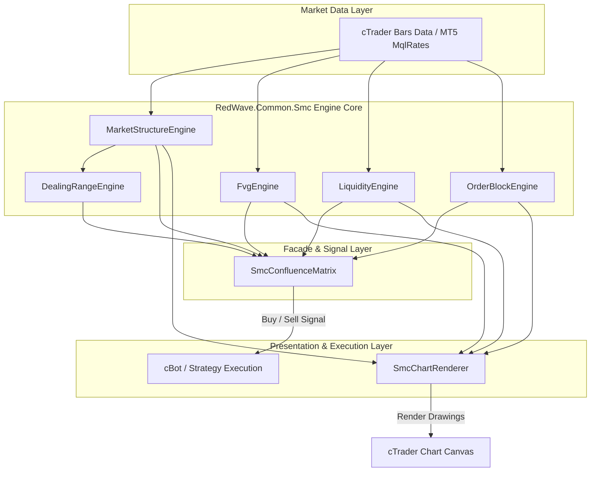
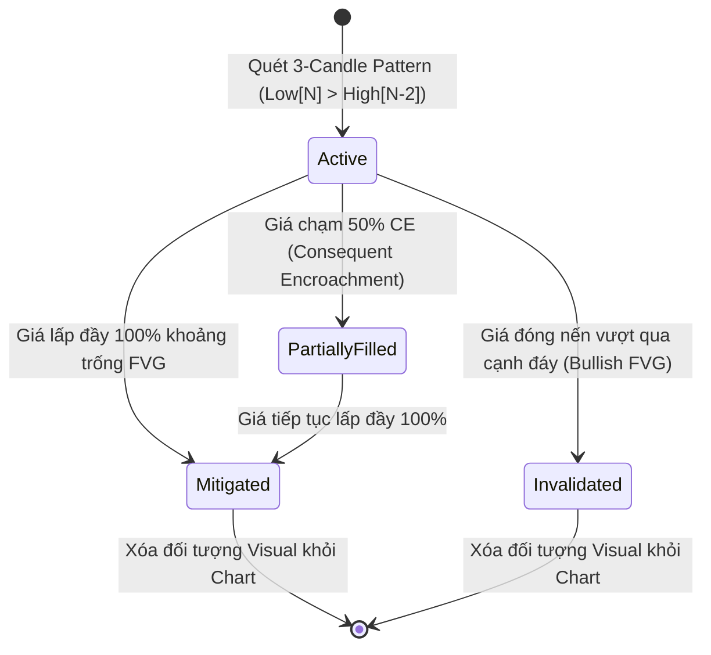

# Technical Architecture Document: SMC / ICT Core Engine (`RedWave.Common.Smc`)

| Attribute | Value |
| :--- | :--- |
| **Status** | Approved |
| **Architect** | `@cbot-expert` |
| **Version** | v1.0 |
| **Target Framework** | .NET Standard 2.0 / C# cTrader API |

---

## 1. System High-Level Architecture

Hệ thống được thiết kế theo mô hình **Modular Component Architecture** kết hợp với **Facade Pattern** (`SmcConfluenceMatrix`).



---

## 2. State Machine Diagrams

### 2.1. FVG Lifecycle State Machine


---

## 3. Data Flow & Processing Pipeline

1. **`OnBar` Event Trigger:** Mỗi khi đóng nến mới, `SmcConfluenceMatrix` điều phối luồng xử lý:
   - `MarketStructureEngine.Update(bars)` $\rightarrow$ Cập nhật Pivot Points, kiểm tra BOS / ChoCH / MSS.
   - `FvgEngine.Update(bars)` $\rightarrow$ Phát hiện FVG mới và cập nhật trạng thái của các FVG cũ (`Active` $\rightarrow$ `Mitigated`).
   - `LiquidityEngine.Update(bars)` $\rightarrow$ Quét BSL/SSL và bắt sự kiện `SweepEvent`.
   - `OrderBlockEngine.Update(bars, activeFvgs)` $\rightarrow$ Lọc Order Block có liên kết FVG hợp lệ.
   - `DealingRangeEngine.Update(swingHigh, swingLow)` $\rightarrow$ Cập nhật mốc 50% Fibonacci Equilibrium.

2. **Visual Render Pass:**
   - Nếu `ShowFvgVisuals == true` $\rightarrow$ `SmcChartRenderer.DrawFvg(...)`.
   - Nếu `AutoCleanVisuals == true` $\rightarrow$ Tự động xóa các đối tượng FVG/OB đã `Mitigated`.

---

## 4. Component Interface Definitions

```csharp
namespace RedWave.Common.Smc
{
    public interface ISmcEngine
    {
        void Update(Bars bars);
        void Reset();
    }

    public interface ISmcRenderer
    {
        void DrawFvg(FairValueGap fvg, bool showVisual);
        void DrawStructure(StructureEvent evt, bool showVisual);
        void DrawOrderBlock(OrderBlock ob, bool showVisual);
        void ClearAll();
    }
}
```

---

## 5. Performance & Memory Guidelines

1. **Memory Allocation:**
   - Sử dụng `List<FairValueGap>` với dung lượng cố định (Ring Buffer hoặc `TakeLast(50)`) để tránh phình to bộ nhớ khi chạy backtest thời gian dài (vài triệu nến).
2. **Chart Object Keys:**
   - Định danh duy nhất cho từng đối tượng hình vẽ trên cTrader:
     - `SMC_FVG_{Id}`
     - `SMC_BOS_{TimeTicks}`
     - `SMC_OB_{Id}`
