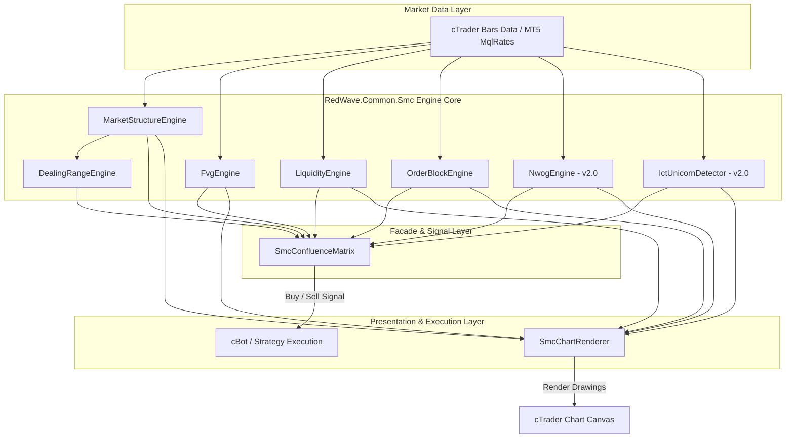
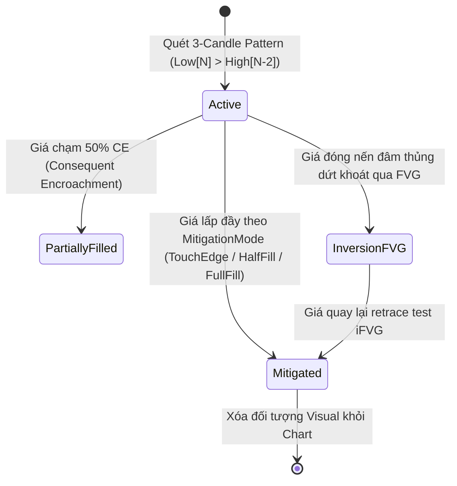

# Technical Architecture Document: SMC / ICT Core Engine (`RedWave.Common.Smc`)

| Attribute | Value |
| :--- | :--- |
| **Status** | Approved (v1.0 Deployed, v2.0 Architecture Planned) |
| **Architect** | `@cbot-expert` |
| **Version** | v2.0 Architecture |
| **Target Framework** | .NET Standard 2.0 / C# cTrader API |

---

## 1. System High-Level Architecture

Hệ thống được thiết kế theo mô hình **Modular Component Architecture** kết hợp với **Facade Pattern** (`SmcConfluenceMatrix`).



---

## 2. State Machine Diagrams

### 2.1. FVG Lifecycle State Machine (Including Inversion FVG)


---

## 3. Advanced Engine Components (v2.0 Specs)

### 3.1. `NwogEngine.cs`
* **Data Structure:**
  ```csharp
  public class OpenGapLevel
  {
      public DateTime OpenTime { get; set; }
      public double GapTopPrice { get; set; }
      public double GapBottomPrice { get; set; }
      public bool IsFilled { get; set; }
  }
  ```

### 3.2. `IctUnicornDetector.cs`
* **Logic:**
  ```csharp
  public bool IsUnicornSetup(OrderBlock ob, FairValueGap fvg)
  {
      if (ob.Type != ObType.BreakerBlock) return false;
      // Kiêm tra Breaker Block và FVG có cùng chiều và trùng vùng giá
      bool isOverlapping = Math.Max(ob.BottomPrice, fvg.BottomPrice) <= Math.Min(ob.TopPrice, fvg.TopPrice);
      return ob.Direction == fvg.Direction && isOverlapping;
  }
  ```

---

## 4. Visual Rendering Pipeline & Color Matrix

```csharp
// Color Definitions
BullishFvgColor = Color.FromArgb(60, 0, 238, 255);   // Cyan
BearishFvgColor = Color.FromArgb(60, 255, 20, 147);  // HotPink

BullishObColor = Color.FromArgb(70, 30, 144, 255);   // RoyalBlue
BearishObColor = Color.FromArgb(70, 153, 50, 204);  // DarkPurple

BullishBosColor = Color.LimeGreen;
BearishBosColor = Color.Crimson;

BullishChochColor = Color.Gold;
BearishChochColor = Color.DarkOrange;

BullishMssColor = Color.Yellow;
BearishMssColor = Color.Magenta;
```

---

## 5. Performance & Memory Guidelines

1. **Max Bars Historical Boundary:** Sử dụng `MaxBarsToScan` (mặc định `500` bars) để cắt ngắn cửa sổ tính toán lịch sử.
2. **Ring Buffer Cleanup:** Tự động xóa các FVG/OB đã `Mitigated` khỏi `List<T>` để duy trì $O(1)$ performance.
3. **Unique Keys:** Đối tượng vẽ cTrader được đánh key chuẩn UUID (`SMC_FVG_{Id}`, `SMC_OB_{Id}`, `SMC_STRUCT_{Time.Ticks}`).
