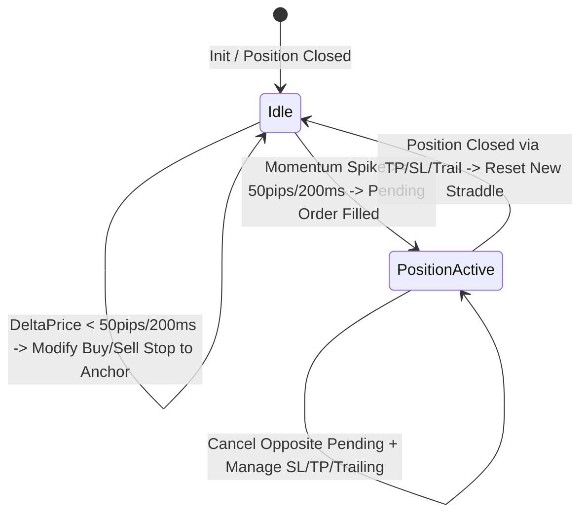

# ARCH: Gold Momentum Straddle Scalper (GRS-01 v2.0) Architecture

## 1. State Machine Diagram

---

## 2. Dynamic Momentum Tracking Logic

- **Anchor Calculation:** $Anchor = \frac{Ask + Bid}{2.0}$
- **Tick Window Queue:** Lưu trữ các mẫu giá `Anchor` trong khoảng thời gian `MomentumWindowMs`.
- **Velocity Delta:** $\Delta P = |Anchor_{now} - Anchor_{oldest\_in\_window}|$
- **Floating Condition:**
  - Nếu `positions.Length == 0`:
    - Nếu $\Delta P < MomentumMinMovePips$, gọi `TradeExecutor.ModifyPendingOrderByPrice` cập nhật `BUY STOP` = $Anchor + Distance$ và `SELL STOP` = $Anchor - Distance$.
    - Nếu $\Delta P \ge MomentumMinMovePips$, ngưng dời pending để giá bứt phá cắn lệnh.
