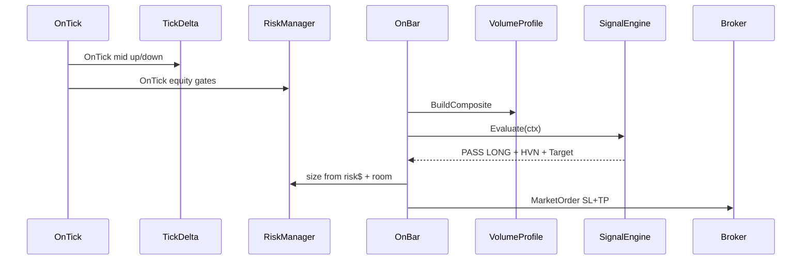

# Architecture — HvnMagnet (HMPD) v1.0

## 1. Layering

```text
┌─────────────────────────────────────────────────────────┐
│  HvnMagnet (Robot)                                      │
│  Params · OnStart / OnBar (signal) / OnTick (exits)     │
└───────────────────────────┬─────────────────────────────┘
                            │
     ┌──────────────────────┼──────────────────────┐
     ▼                      ▼                      ▼
SignalEngine         CVolumeProfile         CTickDeltaEngine
(pure entry)         + ProfileData
     │
     └──────────► CRiskManager · CSessionFilter · CNewsFilter
                  CMarketCondition · CTrailingManager · CLogger
```

**Principle:** Engines have no strategy side-effects. Risk flatten runs **inside** `CRiskManager.OnTick` when init’d with `Robot`. **Do not** call flatten from `OnBar`.

**Template:** Copy structure from `Robots/VacuumHunter` orchestrator; replace LVN path with HVN path and E7 RR gate.

## 2. Runtime flow

### OnStart

1. Logger, VP `ConfigureComposite` (lookback 3, HVN threshold, …).  
2. Delta engine, **RiskManager.Init(this, Symbol, label)**.  
3. Equity DD + daily $ + flatten flags.  
4. Session toggles (Asia/London/NY/Overlap).  
5. News, spread, trailing manager, ATR, HTF bars.  
6. First `BuildComposite`.

### OnTick (**only** place for risk flatten)

```text
TickDeltaEngine.OnTick(bid, ask, time)
RiskManager.OnTick()          ← equity gates + optional ClosePosition
if BE or Trail enabled → TrailingManager.OnTick
if Use Failed Acceptance Exit → evaluate M1 against last signal HVN (optional)
```

### OnBar (signal; **no** risk flatten)

```text
BuildComposite(last closed bar)
Reset daily trade counters (journal)
SignalEngine.Evaluate(ctx)
  EquityOk = RiskManager.IsTradingAllowed
  PASS → ExecuteSignal
```

### ExecuteSignal

```text
SL = HVN edge ± ATR buffer, floored by min SL ×ATR
TP = RiskReward | Structure | FixedPrice (full size)
  if Structure: resolve magnet hierarchy; if R < MinFirstTargetR → abort (should already E7)
riskMoney = min(Balance×Risk%, remaining daily loss room)
volume = CalculateVolumeFromRiskMoney
Configure BE/Trail pips from slDist × R params
ExecuteMarketOrder(SL, TP)
Log OPEN: side, hvn, strength, delta, RR, risk$, volume
```

## 3. SignalEngine contract

### Input `SignalContext`

| Field | Source |
| --- | --- |
| Profile | Last composite `ProfileData` |
| Bar OHLC | Closed signal bar |
| HtfClose | HTF last close |
| Atr | ATR value |
| BuyImbalance / SellImbalance | Delta engine |
| DeltaTickCount | Delta window count |
| SessionOk, NewsOk, SpreadOk, EquityOk | Filters |
| TradesToday, MaxTradesPerDay, HasOpenPosition | Risk ops |
| MinHvnStrength, MaxHvnWidth, TopNHvn | Structure |
| MinDeltaStrength, MinDeltaTicks | E4 |
| RequireDelta / Shape / Htf | Toggles |
| BlockNeutralShape | E5 |
| RequireHvnPocSide | E2pos optional |
| TouchBuffer | E1 |
| RejectionWickBodyRatio | E3 |
| MinFirstTargetR | E7 |
| AllowPocVaTargets | Structure TP path |

### Output `SignalResult`

| Field | Meaning |
| --- | --- |
| IsValid | Pass/fail |
| Side | Long / Short / None |
| Reason | PASS:… or REJECT:… codes |
| Hvn | Entry volume node |
| StructureTarget | Magnet for Structure TP / E7 measure |
| Imbalance | Delta ratio used |
| Shape | Profile shape at evaluate |

### Evaluate pipeline (order)

```text
F1 → F2 → F3 → F3_EQUITY → F4 → F5
→ PROFILE_INVALID?
→ Collect Top-N eligible HVNs (E2)
→ For each side: touch (E1) → rejection (E3) → HTF (E6) → shape (E5) → delta (E4)
→ Resolve structure target → E7 min R
→ Pick best side if both
```

## 4. Structure target resolver

Pure function in SignalEngine or small helper:

```text
ResolveTarget(side, entryPrice, profile, entryHvn, allowPocVa, minR, slDist)
  → VolumeNode or synthetic level {price, label}
  → ok if |target - entry| / slDist >= minR
```

Synthetic levels for POC/VAH/VAL: wrap as ephemeral `VolumeNode` or separate `double TargetPrice` + `string TargetLabel` on `SignalResult` (prefer explicit `TargetPrice` + `TargetLabel` to avoid fake nodes).

**Recommendation:** `SignalResult.TargetPrice` + `TargetLabel` (`HVN`/`POC`/`VAH`/`VAL`) for clarity vs VH’s `StructureTarget` node-only model.

## 5. `CRiskManager` contract

Same as VacuumHunter v1.2:

| API | Role |
| --- | --- |
| `Init(Robot, Symbol, label)` | Full mode + flatten |
| `OnTick()` | From bot OnTick only |
| `IsTradingAllowed` | Entry gate |
| `GetRemainingDailyLossBudget` | Size cap |
| `CalculateVolumeFromRisk*` | FixedRisk + safety |

## 6. Sequence (happy path)



## 7. File layout (implement)

```text
Robots/HvnMagnet/
  HvnMagnet.sln
  HvnMagnet/
    HvnMagnet.csproj   # Compile Include ../../../Common/*.cs
    HvnMagnet.cs
    SignalEngine.cs
  docs/                # this tree
```

## 8. Testing seams

| Layer | How |
| --- | --- |
| SignalEngine | Construct `SignalContext` with synthetic `ProfileData` + bar; assert reject codes |
| Orchestrator | Chart attach + debug rejects |
| Risk | OPEN risk$ vs Balance×Risk% |

No dependency on broker for pure SignalEngine tests (optional NUnit later; v1 may be manual table tests in comments or small harness).
