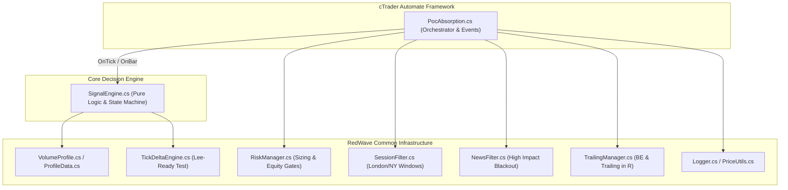
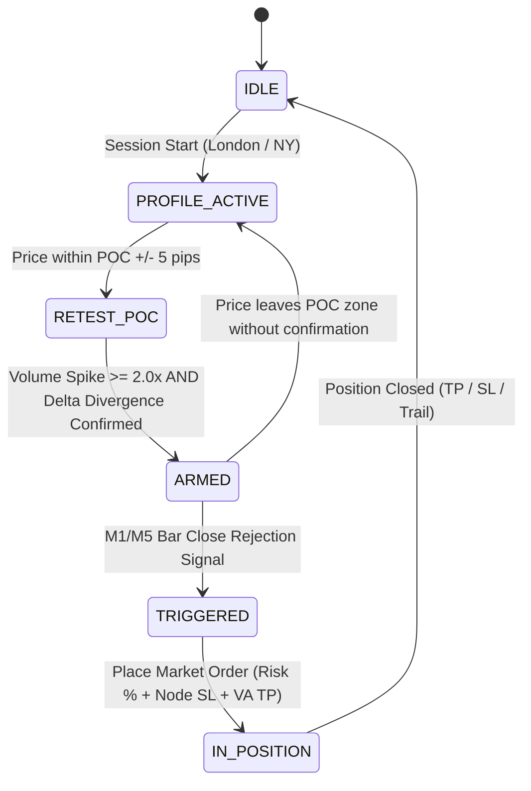

# Architectural Design — PocAbsorption (PADR v1.0)

| Field | Detail |
| --- | --- |
| **Document ID** | ARCH-PADR-V1.0 |
| **Target Bot** | PocAbsorption (`Robots/PocAbsorption/PocAbsorption/PocAbsorption.cs`) |
| **Architect** | cBot Expert / Core Developer |
| **Status** | Approved Architecture Specification |

---

## 1. High-Level System Architecture

Robot tuân thủ mô hình phân lớp chuẩn của RedWave Labs cBot Architecture:



---

## 2. State Machine Workflow

SignalEngine quản lý trạng thái của robot theo sơ đồ chuyển tầng (State Machine):



### State Breakdown

1. **`IDLE`**: Đứng ngoài thị trường (ngoài khung giờ phiên giao dịch hoặc dính tin tức `NewsFilter`).
2. **`PROFILE_ACTIVE`**: Gom tick volume và xây dựng Session Profile liên tục.
3. **`RETEST_POC`**: Giá tiệm cận vùng POC (khoảng cách $\le 5$ pips).
4. **`ARMED`**: Đã đạt đủ 2 điều kiện cứng:
   - Volume tại nốt POC $\ge 2.0 \times \text{Volume Average}$ của 5 nốt lân cận.
   - Cumulative Delta tính từ `TickDeltaEngine` xuất hiện phân kỳ (đổi màu/đẩy ngược chiều giá).
5. **`TRIGGERED`**: Nến M1 hoặc M5 chính thức đóng cửa quay đầu (thể hiện sự chối từ mức giá qua POC).
6. **`IN_POSITION`**: Lệnh đang mở, `TrailingManager` & `RiskManager` giám sát thoát lệnh.

---

## 3. Detailed Component Interaction

### 3.1 Data Flow on `OnTick()`
Toàn bộ logic tính toán theo tick được tối ưu hóa năng lượng CPU để không làm giảm hiệu năng cTrader:
1. `TickDeltaEngine.ProcessTick(Symbol.Ask, Symbol.Bid, Symbol.LastPrice)`: Cập nhật delta tức thời theo thuật toán Lee-Ready.
2. `VolumeProfile.AddTick(Symbol.LastPrice, Symbol.Volume)`: Gom volume vào Price Bin tương ứng ($0.50 step).
3. Nếu đang có vị thế mở (`Positions.Count > 0`): Gọi `RiskManager.OnTick()` và `TrailingManager.OnTick()`.

### 3.2 Logic Flow on `OnBar()` (M1/M5 Rejection Confirmation)
1. Kiểm tra `SessionFilter.IsTradingAllowed()` và `NewsFilter.IsTradingAllowed()`.
2. Kiểm tra trạng thái `ARMED`:
   - Nếu `State == ARMED`, kiểm tra nến M1/M5 vừa đóng cửa.
   - Nếu nến vừa đóng là nến **Rejection** (đóng cửa lại phía trên POC đối với Buy, hoặc dưới POC đối với Sell):
     * Tính toán mép trên/dưới của Node POC ($P_{\text{edge}}$).
     * Calculate SL: $P_{\text{edge}} \pm \text{Buffer}$.
     * Calculate TP: VAH/VAL level hoặc $2.5 \times \text{RiskDistance}$.
     * Validate R:R: Check $\text{Distance}_{\text{TP}} / \text{Distance}_{\text{SL}} \ge \text{MinRR}$.
     * Calculate Lot Size via `RiskManager.CalculateVolume()`.
     * Exec `ExecuteMarketOrder()`.

---

## 4. Technical File Structure

```text
Robots/PocAbsorption/
├── PocAbsorption.sln
└── PocAbsorption/
    ├── PocAbsorption.csproj   <-- Visual link to ../../../Common/*.cs
    ├── PocAbsorption.cs       <-- cBot Framework Handlers
    └── SignalEngine.cs        <-- Strategy Logic Engine
```

---

## 5. Non-Functional Requirements & Safety

* **Zero Memory Leak:** Re-use collections (`Dictionary<double, long>` và `List<TickData>`) bằng cách `.Clear()` thay vì khởi tạo mới ở mỗi phiên.
* **Execution Latency:** Giữ thời gian xử lý trong `OnTick` $< 0.1 \text{ ms}$.
* **cTrader Sandbox Compatibility:** Không phụ thuộc DLL bên ngoài; tất cả Common Files được link trực tiếp qua `.csproj`.
