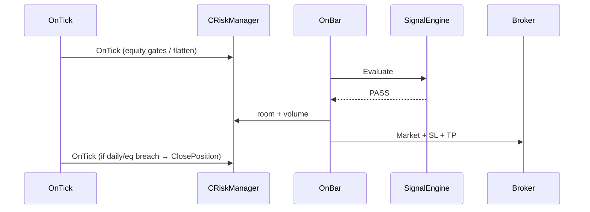

# Architecture — VacuumHunter (current: v1.2)

## 1. Layering

```text
┌─────────────────────────────────────────────────────────┐
│  VacuumHunter (Robot)                                   │
│  Params · OnStart / OnBar (signal) / OnTick (exits)     │
└───────────────────────────┬─────────────────────────────┘
                            │
     ┌──────────────────────┼──────────────────────┐
     ▼                      ▼                      ▼
SignalEngine         CVolumeProfile         CTickDeltaEngine
(pure entry)         + ProfileData
     │
     └──────────► CRiskManager · CSessionFilter · CNewsFilter
                  CMarketCondition · CTrailingManager · CLogger
```

**Principle:** Engines have no strategy side-effects. Risk flatten runs **inside** `CRiskManager.OnTick` when init’d with `Robot`.

## 2. Runtime flow

### OnStart

1. Logger, VP composite, delta, **RiskManager.Init(this, Symbol, label)**.  
2. Set equity DD + daily $ + flatten flags on Risk.  
3. Session toggles (Asia/London/NY/Overlap).  
4. News, spread, trailing manager, ATR, HTF bars.  
5. First `BuildComposite`.

### OnTick (**only** place for risk flatten)

```text
TickDeltaEngine.OnTick
RiskManager.OnTick     ← equity gates + optional ClosePosition (bot label)
if BE or Trail enabled → TrailingManager.OnTick
```

### OnBar (signal; **no** risk flatten)

```text
BuildComposite
Reset daily trade counters (bot journal summary only)
SignalEngine.Evaluate
  EquityOk = RiskManager.IsTradingAllowed(equity, utc)  // gate only
  PASS → ExecuteSignal (SL+TP hard, size with daily room cap)
```

### ExecuteSignal

```text
SL = structure LVN ± ATR buffer, floored by min SL ×ATR
TP = RiskReward | Structure | FixedPrice (full size, broker TP)
riskMoney = min(Balance×Risk%, remaining daily loss room)
volume = CalculateVolumeFromRiskMoney (+ conservative price-unit cap)
Configure BE/Trail pips from this trade’s slDist × R params
ExecuteMarketOrder(SL, TP)
```

## 3. `CRiskManager` contract

| API | Role |
| --- | --- |
| `Init(Robot, Symbol, label)` | Full mode: OnTick can flatten |
| `Init(Symbol)` | Legacy sizing-only (DMS) |
| `OnTick()` | **Must** be called from bot OnTick only |
| `Evaluate(equity, utc)` | Peak DD % + daily $ vs day-start equity |
| `CanOpenNewTrade` / `IsTradingAllowed` | Entry gate |
| `GetDailyPnlMoney` / `GetRemainingDailyLossBudget` | Equity − dayStart; room for sizing |
| `CalculateVolumeFromRisk*` | FixedRisk + conservative vol ≤ risk$/slDist |

**Daily PnL (equity only):**

```text
dayStartEquity = equity first sample of UTC day
dailyPnl$ = equity_now − dayStartEquity   // floating included in equity
```

Does **not** track per-trade TP/SL/NetProfit labels.

## 4. `SignalEngine`

- Input `SignalContext`; output `SignalResult` (LVN, support/resist, optional `StructureTarget`).  
- No TP decision for RR/Fixed modes (bot computes TP).  
- Filters F1–F5, E1–E6 (no E7 hard TP requirement).

## 5. Session

`CSessionFilter`: fixed UTC windows; bot only enables Asia / London / NY / Overlap (OR).

## 6. Sequence (happy path)


